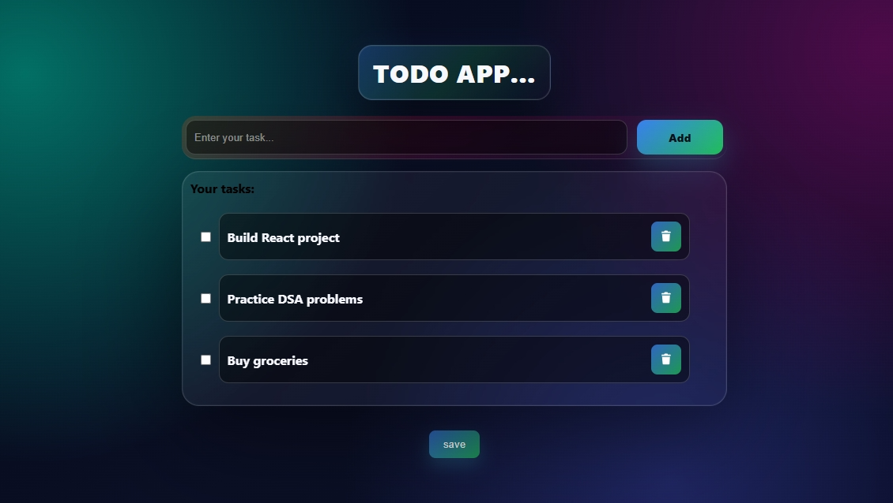

# Todo App

Modern Todo App with add, delete, and persistent storage using Local Storage. Built using HTML, CSS, and JavaScript.

## 📸 Screenshot

## Features

- Add new tasks
- Mark tasks as completed
- Delete tasks
- Save tasks using Local Storage
- Responsive UI design

## Technologies Used

- HTML5
- CSS3
- JavaScript 
- Local Storage API

## How to Use

1. Enter your task in the input field
2. Click on "Add" button
3. Check/uncheck to mark task as completed
4. Click delete icon to remove task
5. Click Save button to store tasks in browser

## Live Demo

https://todo-app-kappa-three-90.vercel.app/

## Author

Lajja Bhajikhaye
